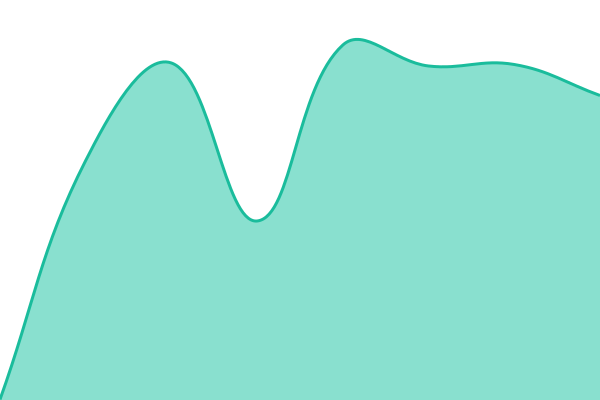

# [📈 Live Status](https://status.reze.app): <!--live status--> **すべてのシステムが正常に稼働しています**

This repository contains the open-source uptime monitor and status page for [Reze](https://lp.reze.app), powered by [Upptime](https://github.com/upptime/upptime).

With [Upptime](https://upptime.js.org), you can get your own unlimited and free uptime monitor and status page, powered entirely by a GitHub repository. We use [Issues](https://github.com/mutex-medical/status/issues) as incident reports, [Actions](https://github.com/mutex-medical/status/actions) as uptime monitors, and [Pages](https://status.reze.app) for the status page.

<!--start: status pages-->
<!-- This summary is generated by Upptime (https://github.com/upptime/upptime) -->
<!-- Do not edit this manually, your changes will be overwritten -->
<!-- prettier-ignore -->
| URL | Status | History | Response Time | Uptime |
| --- | ------ | ------- | ------------- | ------ |
|  Application | 正常 | [application.yml](https://github.com/mutex-medical/status/commits/HEAD/history/application.yml) | 

 2188ms
     
 | 

<a href="https://status.reze.app/history/application">100.00%</a>
    

|  User API | 正常 | [user-api.yml](https://github.com/mutex-medical/status/commits/HEAD/history/user-api.yml) | 

 627ms
     
 | 

<a href="https://status.reze.app/history/user-api">100.00%</a>
    

|  Agent API | 正常 | [agent-api.yml](https://github.com/mutex-medical/status/commits/HEAD/history/agent-api.yml) | 

 623ms
     
 | 

<a href="https://status.reze.app/history/agent-api">100.00%</a>
    

|  Authentication | 正常 | [authentication.yml](https://github.com/mutex-medical/status/commits/HEAD/history/authentication.yml) | 

 614ms
     
 | 

<a href="https://status.reze.app/history/authentication">100.00%</a>
    

|  Storage | 正常 | [storage.yml](https://github.com/mutex-medical/status/commits/HEAD/history/storage.yml) | 

 751ms
     
 | 

<a href="https://status.reze.app/history/storage">100.00%</a>
    

|  Documentation | 正常 | [documentation.yml](https://github.com/mutex-medical/status/commits/HEAD/history/documentation.yml) | 

 696ms
     
 | 

<a href="https://status.reze.app/history/documentation">100.00%</a>
    

|  Landing Page | 正常 | [landing-page.yml](https://github.com/mutex-medical/status/commits/HEAD/history/landing-page.yml) | 

 675ms
     
 | 

<a href="https://status.reze.app/history/landing-page">100.00%</a>
    

|  [Internal] Application | 正常 | [internal-application.yml](https://github.com/mutex-medical/status/commits/HEAD/history/internal-application.yml) | 

 573ms
     
 | 

<a href="https://status.reze.app/history/internal-application">100.00%</a>
    

|  [Internal] API | 正常 | [internal-api.yml](https://github.com/mutex-medical/status/commits/HEAD/history/internal-api.yml) | 

 554ms
     
 | 

<a href="https://status.reze.app/history/internal-api">100.00%</a>
    

|  [Internal] Agent API | 正常 | [internal-agent-api.yml](https://github.com/mutex-medical/status/commits/HEAD/history/internal-agent-api.yml) | 

 642ms
     
 | 

<a href="https://status.reze.app/history/internal-agent-api">100.00%</a>
    

|  [Internal] Authentication | 正常 | [internal-authentication.yml](https://github.com/mutex-medical/status/commits/HEAD/history/internal-authentication.yml) | 

 537ms
     
 | 

<a href="https://status.reze.app/history/internal-authentication">100.00%</a>
    

|  [Internal] Storage | 正常 | [internal-storage.yml](https://github.com/mutex-medical/status/commits/HEAD/history/internal-storage.yml) | 

 685ms
     
 | 

<a href="https://status.reze.app/history/internal-storage">100.00%</a>
    

|  [Internal] Documentation | 正常 | [internal-documentation.yml](https://github.com/mutex-medical/status/commits/HEAD/history/internal-documentation.yml) | 

 657ms
     
 | 

<a href="https://status.reze.app/history/internal-documentation">100.00%</a>
    

<!--end: status pages-->

[**Visit our status website →**](https://status.reze.app)

## 📄 License

- Powered by: [Upptime](https://github.com/upptime/upptime)
- Code: [MIT](./LICENSE) © [Anand Chowdhary](https://anandchowdhary.com), supported by [Pabio](https://pabio.com)
- Data in the `./history` directory: [Open Database License](https://opendatacommons.org/licenses/odbl/1-0/)
